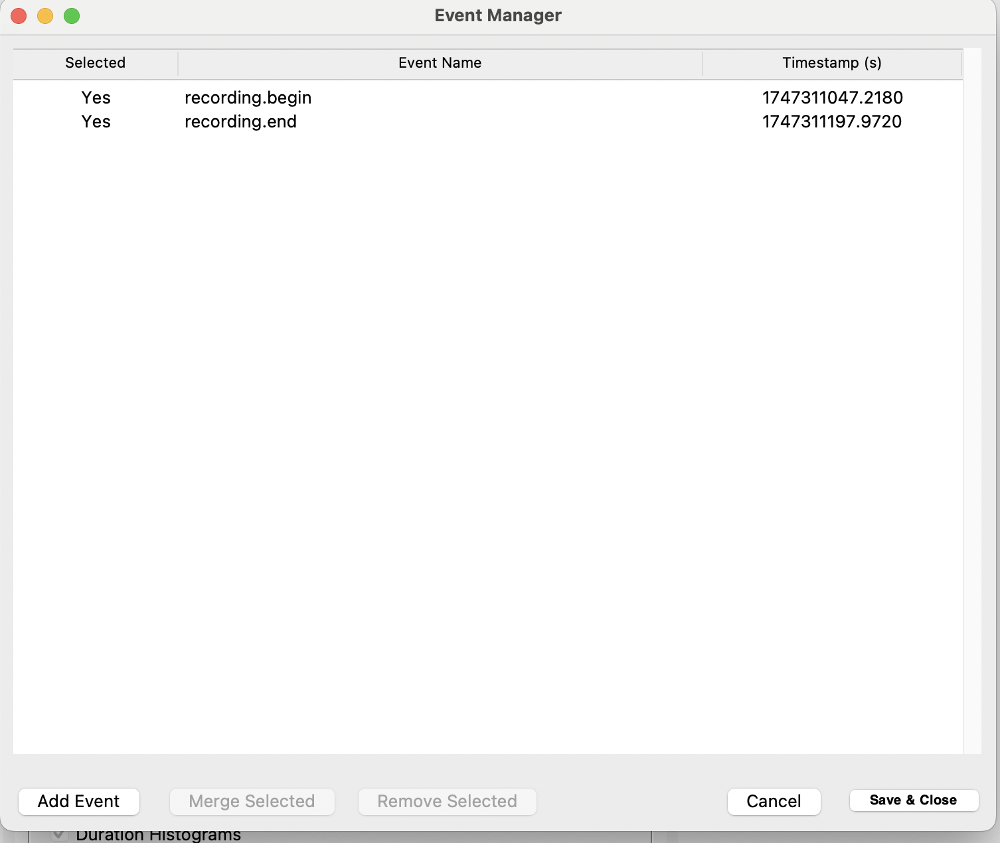
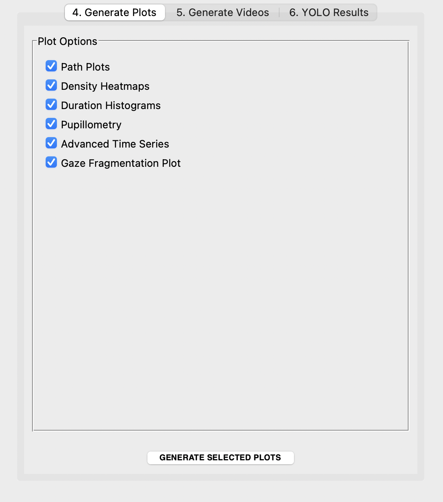
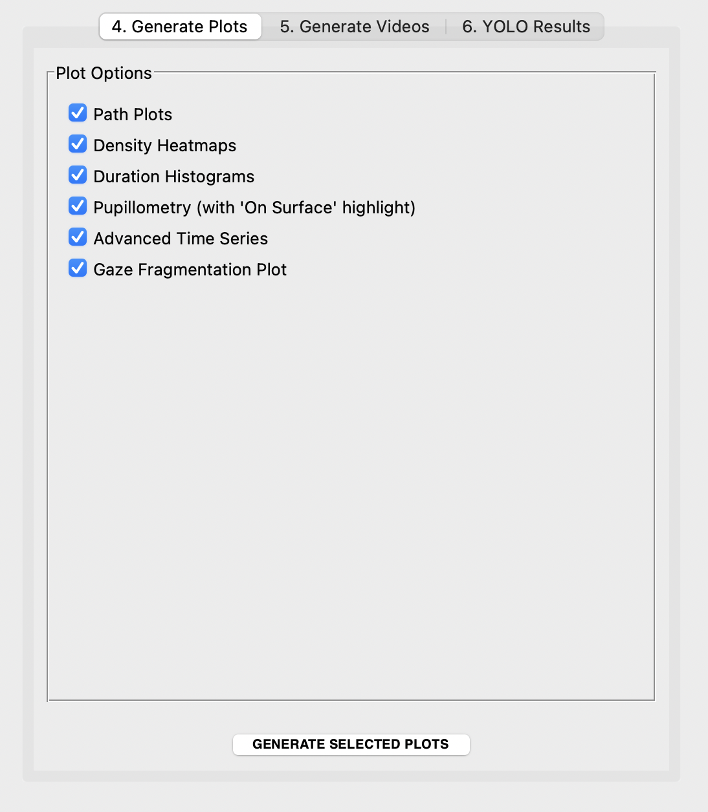
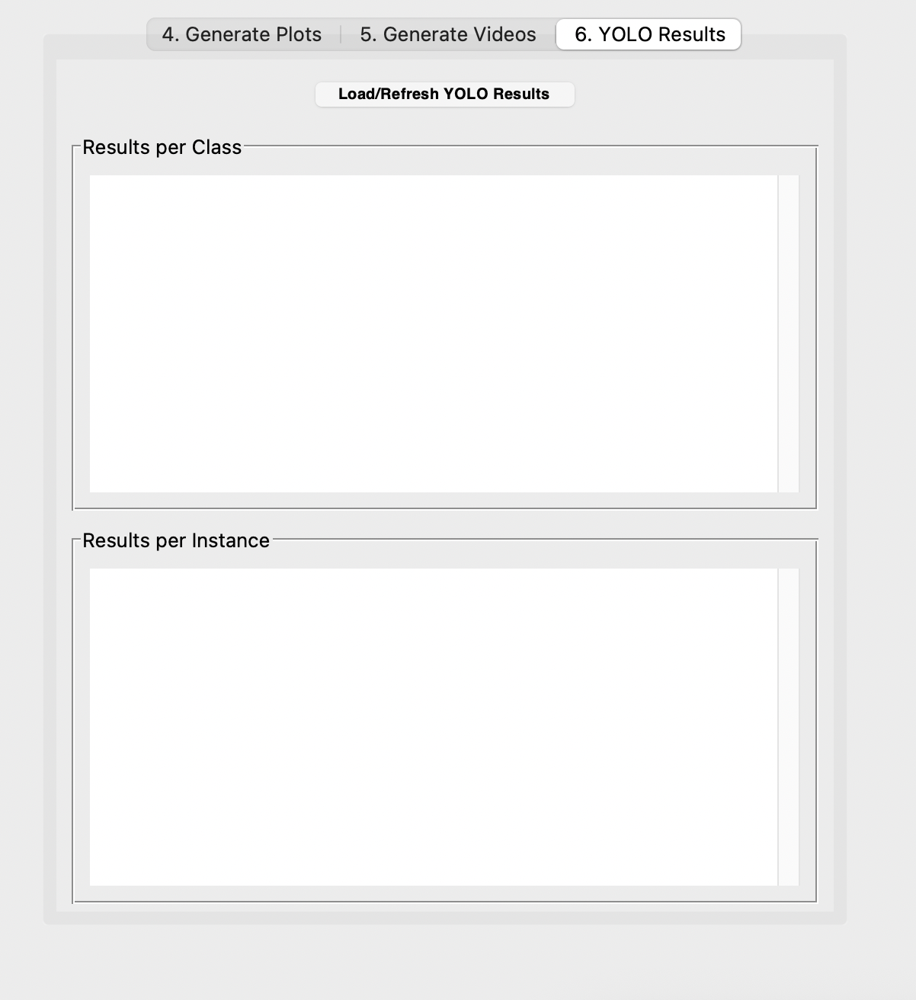

# SPEED v3.5 - labScoc Processing and Extraction of Eye tracking Data

*An Advanced Eye-Tracking Data Analysis Software*

SPEED is a Python-based tool with a graphical user interface (GUI) for processing, analyzing, and visualizing eye-tracking data from cognitive and behavioral experiments.
This version also supports GPU acceleration.

## The Modular Workflow

SPEED v3.5 operates on a two-step workflow designed to save time and computational resources.

**Step 1: Run Core Analysis**
This is the main data processing stage. You run this step **only once** per participant for a given set of events. The software will:
1.  Load all necessary files from the specified input folders (RAW, Un-enriched, Enriched).
2.  Dynamically load events from `events.csv` into the GUI, allowing you to **select which events to analyze**.
3.  Segment the data based on your selection.
4.  Calculate all relevant statistics for each selected segment.
5.  Optionally run YOLO object detection on the video frames, saving the results to a cache to speed up future runs.
6.  Save the processed data (e.g., filtered dataframes for each event) and summary statistics into the output folder.

This step creates a `processed_data` directory containing intermediate files. Once this is complete, you do not need to run it again unless you want to analyze a different combination of events.

**Step 2: Generate Outputs On-Demand**
After the core analysis is complete, you can use the dedicated tabs in the GUI to generate as many plots and videos as you need, with any combination of settings, without re-processing the raw data.
* **Generate Plots:** Select which categories of plots you want to create. Pupillometry plots can now highlight periods where the user's gaze is on a tracked surface.
* **Generate Videos:** Compose highly customized videos. You can select different overlays, display the current event's name, show an "On Surface" indicator, or even **trim the video to include only the selected event segments**.
* **View YOLO Results:** Load and view the quantitative results from the object detection analysis.

---

## Data Acquisition 📋

Before using this software, you need to acquire and prepare the data following a specific procedure with Pupil Labs tools.

* **Video Recording**: Use Pupil Labs Neon glasses to record the session.
* *(optional)* **Surface Definition (AprilTag)**: Place AprilTags at the four corners of a PC screen. These markers allow the Pupil Labs software to track the surface and map gaze coordinates onto it. For more details, see the official documentation: [**Pupil Labs Surface Tracker**](https://docs.pupil-labs.com/neon/neon-player/surface-tracker/).
* **Upload to Pupil Cloud**: Once the recording is complete, upload the data to the Pupil Cloud platform.
* *(optional)* **Enrichment with Marker Mapper**: Inside Pupil Cloud, start the "Marker Mapper" enrichment. This process analyzes the video, detects the AprilTags, generates the `surface_positions.csv` file (which contains the surface coordinates for each frame), and downloads all the data. Marker Mapper Usage Guide: [**Pupil Cloud Marker Mapper**](https://docs.pupil-labs.com/neon/pupil-cloud/enrichments/marker-mapper/#setup).

---

## Environment Setup ⚙️

To run the SPEED analysis tool, you'll need Python 3 and several scientific computing libraries. It's highly recommended to use a virtual environment to manage dependencies.

1.  **Install Anaconda**
    [Anaconda link](https://www.anaconda.com/docs/getting-started/anaconda/install)

2.  **(Optional, for NVIDIA GPU users) Install the CUDA Toolkit**
    To leverage your NVIDIA GPU for faster processing (highly recommended for YOLO analysis), you need to install the NVIDIA CUDA Toolkit. This allows PyTorch to communicate with your graphics card.
    * **Check Compatibility**: Before installing, check which version of CUDA is compatible with the version of PyTorch you plan to use. You can find this information on the [PyTorch installation guide](https://pytorch.org/get-started/locally/).
    * **Download and Install**: Download the appropriate version of the CUDA Toolkit from the official NVIDIA website:
        [**NVIDIA CUDA Toolkit Archive**](https://developer.nvidia.com/cuda-toolkit-archive)
    * Follow the installation instructions for your operating system. You may need to restart your system.

3.  **Create a virtual environment:**

    open Anaconda Prompt

    ```bash
    conda create --name speed
    conda activate speed
    conda install pip
    ```

4.  **Install the required libraries:**
    The required libraries depend on the analysis you want to run. Create a `requirements.txt` file with the content below. For the optional YOLO analysis, you will need `torch` and `ultralytics`.
    ```
    pandas
    numpy
    matplotlib
    opencv-python
    scipy
    tqdm
    moviepy
    # Optional for YOLO analysis
    torch
    ultralytics
    ```
    OR, install them using pip:

    ```bash
    pip install -r requirements.txt
    ```
    * **Note on `Tkinter`**: This is part of the Python standard library and does not require a separate installation.
    * **Note on `torch`**: Installing PyTorch can be complex, especially if you want to use a GPU (highly recommended for YOLO). Please refer to the official PyTorch installation guide for instructions tailored to your system. When installing PyTorch, make sure to select the command that corresponds to the CUDA version you installed.
    * **Note on YOLO**: To use YOLO, you must download the pre-trained neural network weights from the following link: [**yolov8n.pt Download**](https://github.com/ultralytics/assets/releases/download/v0.0.0/yolov8n.pt). Place this file in the same directory as the scripts.

---

## How to Use the Application 🚀

1.  **Launch the GUI**: Run the `GUI.py` script from your terminal.
    ```bash
    cd <drag and drop speed folder>
    python GUI.py
    ```

2.  **Section 1-2: Setup and Input**
    * In the top sections of the GUI, fill in the **Participant Name** and select the **Output Folder**.
    * Use the "Browse..." buttons to select the required **Input Folders**: **RAW** and **Un-enriched**. The **Enriched** folder is optional.

    

3.  **Section 2.5: Advanced Event Management**
    This section provides powerful and flexible tools for managing your experimental events. You have three main ways to load and edit events:

    **Method 1: Default Loading (Automatic)**
    * Simply by selecting the "Un-enriched Data Folder", the application will automatically load the `events.csv` file found inside it. The summary box will update to show how many events were loaded.

    **Method 2: Loading a Custom Event File**
    * Use the **"Browse..."** button in the "Optional Events File" field to select any other `.csv` file from your computer.
    * This file will immediately override the default `events.csv`. This is useful for applying a pre-defined set of events to different recordings without modifying the original data folders.

    **Method 3: Using the Interactive Editors**
    Once events are loaded (using Method 1 or 2), two powerful editing buttons become available:
    * **Edit in Table**: This opens a spreadsheet-like window where you can:
        * **Select/Deselect for Analysis**: Click "Yes" or "No" to toggle an event's inclusion.
        * **Edit Inline**: Double-click on an event's name or timestamp to change its value.
        * **Add/Remove/Merge**: Use the buttons to add new events, delete selected ones, or merge multiple events into a single new one.
        * **Sort**: Instantly reorder all events by their timestamp.
    
    *After editing, click **"Save & Close"** in the editor window. The changes will be saved in memory and used for the analysis.*

    

    * **Edit on Video**: This opens a revolutionary interactive video editor:
        * **Visual Playback**: Watch the `external.mp4` video with standard play/pause controls.
        * **Timeline Navigation**: A timeline below the video shows markers for all current events. Click anywhere on the timeline to jump to that frame.
        * **Add Events**: Pause the video at the exact moment you need, and click "Add Event at Current Frame" to create a new event marker.
        * **Drag & Drop Editing**: Click and drag an existing event marker along the timeline to intuitively adjust its timestamp.
        * **Remove Events**: Select an event by clicking its marker and use the "Remove Selected Event" button.
    
    [GUI - Interactive Event Management](images/gui_events_interactive.png)

4.  **Section 3: Run Core Analysis**
    * In the "Run Core Analysis" section, configure the analysis mode (e.g., `un-enriched only`, `Run YOLO`).
    * Click the **"RUN CORE ANALYSIS"** button. This will use the final, user-edited list of events to perform the main data processing.

5.  **Section 4: Generate Plots**
    * Switch to the "4. Generate Plots" tab.
    * Select the categories of plots you wish to generate.
    * Click the **"GENERATE SELECTED PLOTS"** button.

    

6.  **Section 5: Generate Videos**
    * Switch to the "5. Generate Videos" tab.
    * Configure the video composition and set the **Output Video Filename**.
    * Click the **"GENERATE VIDEO"** button.

    

7.  **Section 6: YOLO Results**
    * Switch to the "6. YOLO Results" tab.
    * Click **"Load/Refresh YOLO Results"** to view the statistics.

    

## Input Folder Structure 📂

The application now expects a specific folder structure as input. You must organize the files exported from Pupil Cloud into three separate folders.

### 1. RAW Data Folder
This folder should contain the raw media files.
| Filename | Requirement |
|---|---|
| `Neon Sensor Module v1 ps1.mp4` | **Always** (will be renamed to `internal.mp4`) |

### 2. Un-enriched Data Folder
This folder contains the main gaze and event data in pixel coordinates, along with the scene video.
| Filename | Requirement |
|---|---|
| `external.mp4` (or any single `.mp4`) | **Always** (must be only one video file) |
| `events.csv` | **Always** |
| `gaze.csv` | **Always** |
| `fixations.csv` | **Always** |
| `blinks.csv` | **Always** |
| `saccades.csv` | **Always** |
| `3d_eye_states.csv` | **Always** |
| `world_timestamps.csv` | **Always** |

### 3. Enriched Data Folder
This folder contains data that has been "enriched" in Pupil Cloud, typically mapped to a defined surface.
| Filename | Requirement |
|---|---|
| `gaze.csv` | Required if "un-enriched only" is **unchecked** (will be used as `gaze_enriched.csv`) |
| `fixations.csv` | Required if "un-enriched only" is **unchecked** (will be used as `fixations_enriched.csv`) |
| `surface_positions.csv` | Required for video perspective correction and "On Surface" overlays |

## Output Files 📈

All outputs are saved within the specified `analysis_results_{participant_name}` folder.

* **`eyetracking_file/`**: Contains copies of all the input files used for the analysis.
* **`processed_data/`**: Contains intermediate data files (`.pkl`) for each **selected** event segment.
* **`plots/`**: Contains all the generated PDF plots for the analyzed events.
* **`config.json`**: A file saving the settings used for the Core Analysis, including the `selected_events` list for reproducibility.
* **`summary_results_{subj_name}.csv`**: A CSV file with the main quantitative outcomes of the analysis for the selected events.
* **`{video_name}.mp4`**: Each custom video you generate is saved in the main output folder. The audio will be included if available in the original file.
* **YOLO Outputs**:
    * `yolo_detections_cache.csv`: A cache of the raw YOLO detections.
    * `stats_per_class.csv`: Aggregated statistics for each object class.
    * `stats_per_instance.csv`: Statistics for each individual tracked object instance.
    * `class_id_map.csv`: A utility file that maps tracking IDs to class names.

### Description of Output Plots

The "Generate Plots" tab can create several visualizations for each analyzed event segment. Here is a description of each:

* **Duration Histograms (`histograms`)**
    * **Purpose**: Shows the frequency distribution of the durations of fixations, blinks, and saccades.
    * **Usefulness**: Helps to quickly understand if eye movements or blinks were predominantly short or long during a segment.

* **Path Plots (`path_plots`)**
    * **Purpose**: Visualizes the sequence of gaze points (Gaze Path) or fixations (Fixation Path) over time.
    * **Usefulness**: Allows for the reconstruction of the user's visual path on the screen (un-enriched data, in pixels) or on a normalized surface (enriched data).

* **Heatmaps (`heatmaps`)**
    * **Purpose**: Generates a density map that highlights the areas where gaze (Gaze Heatmap) or fixations (Fixation Heatmap) were most concentrated.
    * **Usefulness**: Provides an immediate view of the areas of greatest visual interest. Hotter areas (red) indicate more attention.

* **Pupillometry (`pupillometry`)**
    * **Purpose**: Shows the trend of the pupil diameter (in mm) over time. The plot can include a colored background: green when the gaze is on the tracked surface, red when it is not (requires enriched data). Spectral analyses (Periodogram and Spectrogram) are also generated to examine the frequencies of pupil fluctuation.
    * **Usefulness**: Pupil diameter is often correlated with cognitive load, effort, and emotional response. Spectral analysis can reveal rhythmic patterns not visible in the raw signal.

* **Gaze Fragmentation (`fragmentation`)**
    * **Purpose**: Displays the speed of the gaze (pixels/second) over time.
    * **Usefulness**: High fragmentation values indicate more erratic and less stable visual scanning, which can be an index of uncertainty or widespread visual exploration.

* **Advanced Time Series (`advanced_timeseries`)**
    * **Purpose**: Offers a series of detailed plots over time, including the amplitude and velocity of saccades and a binary representation of the presence of blinks.
    * **Usefulness**: Provides a more in-depth analysis of the dynamics of individual ocular events during a segment.

### Custom Video Composition

The "Generate Videos" tab is a powerful tool for creating dynamic visualizations that combine the scene video with eye-tracking data. The options can be combined to create highly informative outputs.

* **Structural Video Options**
    * **Trim video to include selected events only**: Instead of generating a video of the entire session, this option creates clips that start with a selected event and end at the beginning of the next, focusing attention only on the salient moments.
    * **Crop & Correct Perspective**: If AprilTags were used, this option straightens the video image to show only the tracked surface (e.g., a PC screen) as a perfect rectangle, correcting for distortions due to head angle.

* **Data Overlays**
    * **Gaze Point**: Draws a circle (usually red) indicating exactly where the user is looking in each frame.
    * **YOLO Detections**: If YOLO analysis was performed, this option draws bounding boxes around detected objects, with labels showing the class name and tracking ID.
    * **Internal Camera (PiP)**: Shows the video from the camera recording the user's eye in a small Picture-in-Picture frame, useful for verifying tracking quality.
    * **Event Text**: Displays the name of the current event at the top of the screen, providing immediate context about what is happening in the session.
    * **'On Surface' Text**: Shows a text indicator (usually green) when the participant's gaze is within the boundaries of the tracked surface (requires enriched data).
    * **Pupillometry Plot**: Renders a real-time graph of the pupil diameter directly onto the video.
    * **Fragmentation Plot**: Similar to the above, but shows the trend of gaze speed.

* **Combining Features**
    The real power lies in combining these options. For example, you can create a video that:
    1.  Is **trimmed** to show only the "Difficult Task" event segment.
    2.  Has the **perspective corrected** onto the computer screen.
    3.  Shows the user's **gaze point** and **YOLO boxes** on specific interface buttons.
    4.  Displays the **pupillometry plot** in a corner to visually correlate the increase in pupil diameter with complex actions.
    5.  Shows the **"Difficult Task"** text at the top for clear contextual reference.
---
## 🧪 Synthetic Data Generator (`generate_synthetic_data.py`)

Included in this project is a utility script to create a full set of dummy eye-tracking data. This is extremely useful for testing the SPEED software without needing Pupil Labs hardware or actual recordings.

### Purpose
The script generates all the necessary `.csv` and `.mp4` files that mimic a real recording session, including gaze movements, blinks, saccades, a moving surface, and the corresponding scene and eye videos.

### How to Use
1.  Run the script from your terminal:
    ```bash
    python generate_synthetic_data.py
    ```
2.  The script will create a new folder named `synthetic_data_output` in the current directory.
3.  This folder will contain all the necessary files (`gaze.csv`, `fixations.csv`, `world.mp4`, etc.).
4.  In the SPEED GUI, you can now use the folders inside `synthetic_data_output` as input to run a full analysis pipeline.

---
## ✍️ Authors & Citation

* This tool is developed by the **Cognitive and Behavioral Science Lab (LabSCoC), University of L'Aquila** and **Dr. Daniele Lozzi**.
* If you use this script in your research or work, please cite the following publications:
    * Lozzi, D.; Di Pompeo, I.; Marcaccio, M.; Ademaj, M.; Migliore, S.; Curcio, G. SPEED: A Graphical User Interface Software for Processing Eye Tracking Data. NeuroSci 2025, 6, 35. <https://doi.org/10.3390/neurosci6020035>
    * Lozzi, D.; Di Pompeo, I.; Marcaccio, M.; Alemanno, M.; Krüger, M.; Curcio, G.; Migliore, S. AI-Powered Analysis of Eye Tracker Data in Basketball Game. Sensors 2025, 25, 3572. <https://doi.org/10.3390/s25113572>

* It is also requested to cite Pupil Labs publication, as requested on their website <https://docs.pupil-labs.com/neon/data-collection/publicatheir-and-citation/>
    * Baumann, C., & Dierkes, K. (2023). Neon accuracy test report. Pupil Labs, 10. <https://doi.org/10.5281/zenodo.10420388>

* If you also use the Computer Vision YOLO-based feature, please cite the following publication:
    * Redmon, J., Divvala, S., Girshick, R., & Farhadi, A. (2016). You only look once: Unified, real-time object detection. In Proceedings of the IEEE conference on computer vision and pattern recognition (pp. 779-788). <https://doi.org/10.1109/CVPR.2016.91>

## 💻 Artificial Intelligence disclosure

This code is partially written using Google Gemini 2.5 Pro