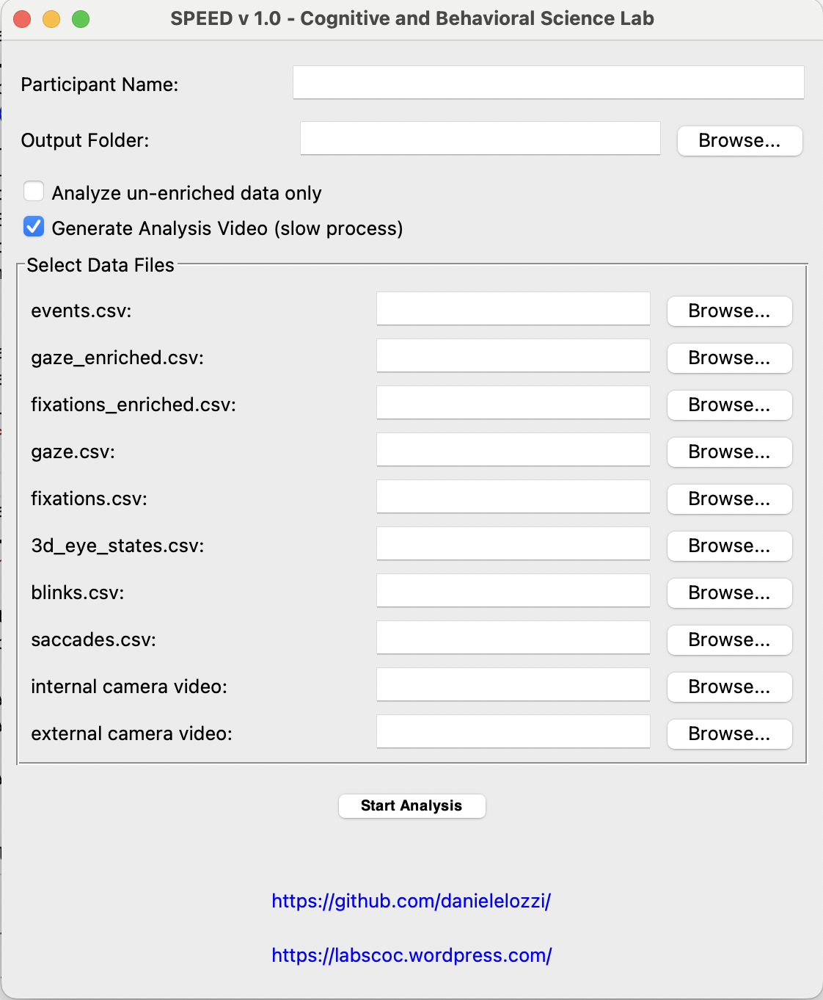

# SPEED (labScoc Processing and Extraction of Eye tracking Data)

*Eye-Tracking Data Analysis Software*

** NEW VERSION WITH COMPUTER-VISION FEATURES :*[SPEED-CV] labScoc Processing and Extraction of Eye tracking Data - Computer Vision* ** [https://github.com/danielelozzi/SPEED-CV](https://github.com/danielelozzi/SPEED-CV).

SPEED is a Python-based tool with a graphical user interface (GUI) for processing and analyzing eye-tracking data from cognitive and behavioral experiments. It is designed to segment data based on predefined events, calculate key metrics, and generate visualizations of eye movements like gaze paths and fixations.

The tool can handle both raw (un-enriched) and surface-projected (enriched) eye-tracking data, making it flexible for various stages of the analysis pipeline.

## Data acquisition 📋

Before using this software, you need to acquire and prepare the data following a specific procedure with Pupil Labs tools.
* **Video Recording**: Use Pupil Labs Neon glasses to record the session
* *optionally* **Surface Definition (AprilTag)**: Place AprilTags at the four corners of the PC screen. These markers allow the Pupil Labs software to track the surface and map the coordinates of the gaze on it. For more details, see the official documentation: [**Pupil Labs Surface Tracker**](https://docs.pupil-labs.com/neon/neon-player/surface-tracker/).
**Upload to Pupil Cloud**: Once the recording is complete, upload the data to the Pupil Cloud platform.
* *optionally* **Enrichment with Marker Mapper**: Inside Pupil Cloud, start the Marker Mapper enrichment. This process analyzes the video, detects AprilTags and generates the file `surface_positions.csv`, which contains the surface coordinates for each frame and downloads all the data. Marker Mapper Usage Guide: [**Pupil Cloud Marker Mapper**](https://docs.pupil-labs.com/neon/pupil-cloud/enrichments/marker-mapper/#setup).

## Features ✨

* **Graphical User Interface (GUI)**: An intuitive `Tkinter`-based interface for easy file selection and configuration.
* **Event-Based Segmentation**: Analyzes eye-tracking data in segments defined by timestamps in an `events.csv` file.
* **Dual Analysis Mode**: Supports both "un-enriched" (pixel-based) and "enriched" (surface-normalized) data. If enriched data is provided, the tool can run a dual analysis to produce results for both modes.
* **Path Plot Generation**: Automatically creates and saves PDF plots for fixation paths and raw gaze paths for each event segment.
* **Summary Statistics**: Generates a final CSV file with aggregated metrics for each analysis segment.
* **Automated File Management**: Creates a structured output folder for each participant, copying input files and saving results neatly.
* **Enhanced Pupillometry Plotting**: Generates a detailed pupillometry time series plot with dynamic background coloring (green for gaze on surface, red for gaze off surface) and separate lines for left and right pupil diameters (if available), providing insights into attention and cognitive load.
* **Saccade Analysis Plots**: Visualizes mean and peak saccade velocities over time, as well as saccade amplitude over time.
* **Blink Time Series**: Provides a binary time series plot indicating the presence or absence of blinks.
* **Density Heatmap Generation**: Creates heatmaps that visualize the areas of highest concentration for fixations and gaze points. This visualization uses a kernel density estimate (KDE) to graphically represent eye-tracking data.

## Environment Setup ⚙️

To run the SPEED analysis tool, you'll need Python 3 and several scientific computing libraries. It's highly recommended to use a virtual environment to manage dependencies.

1.  **Create a virtual environment:**
    ```bash
    python -m venv speed-env
    source speed-env/bin/activate  # On Windows, use `speed-env\Scripts\activate`
    ```

2.  **Install the required libraries:**
    Based on the scripts, the required libraries are `pandas`, `numpy`, `matplotlib`, `opencv-python`, and `scipy`. Create a `requirements.txt` file with the following content:
    ```
    pandas
    numpy
    matplotlib
    opencv-python
    scipy
    ```
    Then, install them using pip:
    ```bash
    pip install -r requirements.txt
    ```
    *Note: `Tkinter` is part of the Python standard library and does not require a separate installation.*

## How to Use the Application 🚀

1.  **Launch the GUI**: Run the `SPEED_gui.py` script from your terminal.
    ```bash
    python SPEED_gui.py
    ```

2.  **Fill in the Information**:
    * **Participant Name**: Enter a unique identifier for the participant. This name will be used to create the main output folder.
    * **Output Folder**: The application will automatically suggest an output path based on the participant's name (e.g., `./analysis_results_participant_name`). You can also use the "Browse..." button to select a different location.
    * **Analysis Options**:
        * `Analyze un-enriched data only`: Check this if you only want to process data using pixel coordinates from the raw eye-tracking files (`fixations.csv`, `gaze.csv`). This will disable the input fields for enriched data files.
        * `Generate Analysis Video`: If checked, the tool will attempt to create a video overlay of the analysis (this is a slower process).

3.  **Select Input Files**:
    * Click the "Browse..." button next to each file type to select the corresponding data file for your participant. See the table below for a description of each file.

4.  **Start the Analysis**:
    * Once all required fields are filled and files are selected, click the **"Start Analysis"** button.
    * The status label at the bottom will show the progress of the analysis.
    * Upon successful completion, a confirmation message will appear, and the results will be available in the specified output folder.

    

## Input Files 📂

The application requires several specific CSV and MP4 files from your eye-tracking experiment. The `REQUIRED_FILES` are listed below.

| Standard Name | Display Label (in GUI) | Description | Required |
| --- | --- | --- | --- |
| `events.csv` | `events.csv` | Contains timestamps that define the start and end of experimental segments. | **Always** |
| `gaze_enriched.csv` | `gaze CSV file (enriched)` | Gaze data with coordinates normalized to a detected surface. | Optional (if "un-enriched only" is checked) |
| `fixations_enriched.csv` | `enriched fixations CSV file` | Fixation data with coordinates normalized to a detected surface. | Optional (if "un-enriched only" is checked) |
| `gaze.csv` | `un-enriched gaze CSV file` | Raw gaze data with coordinates in pixels (`px`). | **Always** |
| `fixations.csv` | `un-enriched fixations CSV file` | Raw fixation data with coordinates in pixels (`px`). | **Always** |
| `3d_eye_states.csv` | `3D eye states CSV file (pupil)` | Pupil diameter and other 3D eye model data. | **Always** |
| `blinks.csv` | `blinks CSV file` | Data on blink events. | **Always** |
| `saccades.csv` | `saccades CSV file` | Data on saccadic movements. | **Always** |
| `internal.mp4` | `internal camera video` | The video recording of the participant's eye. | **Always** |
| `external.mp4` | `external camera video` | The video recording of the participant's scene/view. **Used to get video dimensions and for video generation.** | **Always** |

### Output Files 📈

The analysis generates a main folder named `analysis_results_{participant_name}` with the following contents:

1.  **`eyetracking_file/`**
    * A subfolder containing copies of all the input files used for the analysis. This ensures reproducibility.

2.  **Summary Results (`.csv`)**
    * `summary_results_{subj_name}.csv`: A CSV file containing the main quantitative outcomes of the analysis. It includes one row per event segment and columns for various metrics like number of fixations, average fixation duration, pupil diameter statistics, and movement characteristics.

3.  **Analysis Plots (`.pdf`)**

    *These plots visualize different aspects of the eye-tracking data for each event segment. Depending on the analysis, filenames may contain _enriched or _not_enriched suffixes.*

    * `hist_fixations_{subj_name}_{event_name}.pdf`: A histogram of fixation durations.
    * `hist_blinks_{subj_name}_{event_name}.pdf`: A histogram of blink durations.
    * `hist_saccades_{subj_name}_{event_name}.pdf`: A histogram of saccade durations.
    * `path_fixation_enriched_{subj_name}_{event_name}.pdf`: A plot showing the sequence and path of fixations when detected on a surface. The coordinates are normalized from 0 to 1.
    * `path_fixation_not_enriched_{subj_name}_{event_name}.pdf`: A plot showing the sequence and path of raw fixations in pixels.
    * `path_gaze_enriched_{subj_name}_{event_name}.pdf`: A plot showing the sequence and path of gaze points when detected on a surface. The coordinates are normalized from 0 to 1.
    * `path_gaze_not_enriched_{subj_name}_{event_name}.pdf`: A plot showing the sequence and path of raw gaze points in pixels.
    * `heatmap_fixation_{subj_name}_{event_name}.pdf`: A density heatmap (based on KDE) showing areas of high fixation concentration.
    * `heatmap_gaze_{subj_name}_{event_name}.pdf`: A density heatmap (based on KDE) showing areas of high gaze concentration.
    * `periodogram_{subj_name}_{event_name}.pdf`: A Power Spectral Density plot of the pupil diameter signal, showing frequency components.
    * `spectrogram_{subj_name}_{event_name}.pdf`: A spectrogram of the pupil diameter, showing how its frequency content changes over time.
    * `pupil_diameter_gaze_surface_{subj_name}_{event_name}.pdf`: A time series plot of left and right pupil diameters. The background dynamically changes to green when gaze is detected on the surface and red when it is not.
    * `pupil_diameter_mean_gaze_surface_{subj_name}_{event_name}.pdf`: A time series plot of the mean pupil diameter. Similar to the other pupillometry plot, the background is colored to indicate gaze position.
    * `saccade_velocities_{subj_name}_{event_name}.pdf`: A time series plot showing the mean and peak velocity of saccades (in pixels/second).
    * `saccade_amplitude_{subj_name}_{event_name}.pdf`: A time series plot showing the amplitude of saccades (in pixels).
    * `blink_time_series_{subj_name}_{event_name}.pdf`: A binary time series plot indicating when blink events occurred (1 for blink, 0 for no blink).
   
4.  **Analysis Video (`.mp4`)**
    * `output_analysis_video.mp4`: An MP4 video that synchronizes the internal (eye) view, the external (scene) view, and a real-time plot of the pupil diameters (right, left, mean) and blinks. This is only generated if the "Generate Analysis Video" option is checked.

    *Note on Suffixes*: If "Dual Analysis Mode" is active, you will get separate plots for each mode: `_enriched.pdf` for surface-based data and `_not_enriched.pdf` for pixel-based data. If only one mode is run, the files will not have this suffix. Similar to the plots, the summary file will be suffixed with `_enriched.csv` or `_not_enriched.csv` when running in Dual Analysis Mode.
---

## ✍️ Authors & Citation

* Dr. Daniele Lozzi
* Dr. Ilaria Di Pompeo
* Martina Marcaccio
* Matias Ademaj
* Dr. Simone Migliore
* Prof. Giuseppe Curcio


*If you use this script in your research or work, please cite the following publications:*

Lozzi, D.; Di Pompeo, I.; Marcaccio, M.; Ademaj, M.; Migliore, S.; Curcio, G. SPEED: A Graphical User Interface Software for Processing Eye Tracking Data. NeuroSci 2025, 6, 35. [https://doi.org/10.3390/neurosci6020035](https://doi.org/10.3390/neurosci6020035)

Lozzi, D.; Di Pompeo, I.; Marcaccio, M.; Alemanno, M.; Krüger, M.; Curcio, G.; Migliore, S. AI-Powered Analysis of Eye Tracker Data in Basketball Game. Sensors 2025, 25, 3572. [https://doi.org/10.3390/s25113572](https://doi.org/10.3390/s25113572)

---

*This tool is developed for the Cognitive and Behavioral Science Lab. For more information, visit [our website](https://labscoc.wordpress.com/).*
