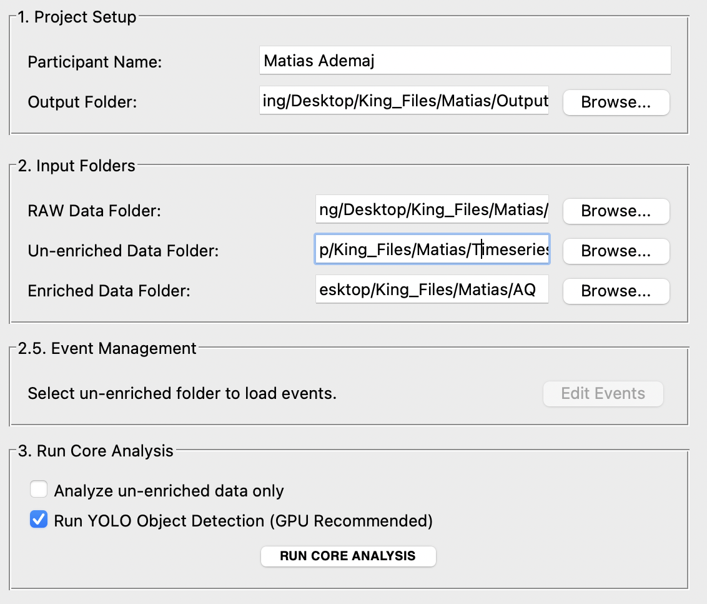

# Welcome to the Official Page for SPEED v3.6

*An Advanced Eye-Tracking Data Analysis Software for Researchers*

SPEED is a Python-based project for processing, analyzing, and visualizing eye-tracking data. This project offers two main components: a user-friendly **Desktop App** and a powerful **`speed-analyzer` Python package**.



## Quick Links

- **[Download the App](#1-speed-desktop-application-for-end-users)**
- **[Install the Python Package](#2-speed-analyzer-python-package-for-developers)**
- **[Use with Docker](#3-docker-container-for-maximum-reproducibility)**
- **[GitHub project](https://www.github.com/danielelozzi/SPEED/)**
- **[GitHub website](https://danielelozzi.github.io/SPEED/)**


---

## What is SPEED?

SPEED is designed for cognitive and behavioral experiments, providing a modular workflow that saves time and computational resources. From data processing to generating plots and videos, SPEED offers a comprehensive suite of tools for eye-tracking analysis.

### Core Features
* **Modular Analysis**: Run heavy processing once, then generate unlimited plots and videos on-demand.
* **Advanced Event Editors**: Manage experimental events in a table or directly on an interactive video timeline.
* **Computer Vision Integration**: Leverage YOLO object detection to correlate gaze with objects in the scene.
* **Rich Visual Outputs**: Create heatmaps, gaze paths, pupillometry plots, and highly customized video overlays.

## Getting Started

To get started, you can either download the pre-compiled desktop application or install the Python package for coding use.

## 1. SPEED Desktop Application (For End Users)

An application with a graphical user interface (GUI) for a complete, visually-driven analysis workflow.

### How to Use the Application
1.  **Download the latest version**: Go to the [Releases page](https://github.com/danielelozzi/SPEED/releases) and download the `.zip` file for your operating system (Windows or macOS).
2.  **Extract and Run**: Unzip the file and run the `SpeedApp` executable.
3.  **Follow the Instructions**: Use the interface to select your data folders (RAW, Un-enriched, etc.), manage events with the interactive editors, and run the analysis.

---

## 2. `speed-analyzer` (Python Package for Developers)

The core analysis engine of SPEED, now available as a reusable package. It's designed for automation and integration into custom data pipelines.

### Installation from PyPI
You can install the package directly from the Python Package Index (PyPI) using pip:
```bash
pip install speed-analyzer
```
### How to Use the Package
The package exposes a main function, `run_full_analysis`, that takes paths and options as arguments. See the `example_usage.py` file for a complete demonstration.

Here is a basic snippet:

```python
import pandas as pd
from speed_analyzer import run_full_analysis

# 1. Define paths and parameters
raw_path = "./data/raw"
unenriched_path = "./data/unenriched"
output_path = "./analysis_results"

# 2. Create an events DataFrame
events_df = pd.DataFrame({
    'name': ['Task_Start', 'Task_End'],
    'timestamp [ns]': [1672531201000000000, 1672531215000000000]
})

# 3. Run the full analysis programmatically
run_full_analysis(
    raw_data_path=raw_path,
    unenriched_data_path=unenriched_path,
    output_path=output_path,
    subject_name="participant_01",
    events_df=events_df,
    run_yolo=True,
    yolo_model_path="yolov8n.pt"
)
```

---

## 3. Docker Container (For Maximum Reproducibility)

To ensure maximum scientific reproducibility and to eliminate any issues with installation or dependencies, we provide a pre-configured Docker image that contains the exact environment to run the `speed-analyzer` package.

### Prerequisites
You must have **Docker Desktop** installed on your computer. You can download it for free from the [official Docker website](https://www.docker.com/products/docker-desktop/).

### How to Use the Docker Image

1.  **Pull the Image (Download)**:
    Open a terminal and run this command to download the latest version of the image from the GitHub Container Registry (GHCR).
    ```bash
    docker pull ghcr.io/danielelozzi/speed:latest
    ```

2.  **Run the Analysis**:
    To launch an analysis, you need to use the `docker run` command. The most important part is to "mount" your local folders (containing the data and where to save the results) inside the container.

    Here is a complete example. Replace the `/path/to/...` placeholders with the actual absolute paths on your computer.
    ```bash
    docker run --rm \
      -v "/path/to/your/RAW/folder:/data/raw" \
      -v "/path/to/your/un-enriched/folder:/data/unenriched" \
      -v "/path/to/your/output/folder:/output" \
      ghcr.io/danielelozzi/speed:latest \
      python -c "from speed_analyzer import run_full_analysis; run_full_analysis(raw_data_path='/data/raw', unenriched_data_path='/data/unenriched', output_path='/output', subject_name='docker_test')"
    ```
    
    **Command Explanation:**
    * `docker run --rm`: Runs the container and automatically removes it when finished.
    * `-v "/local/path:/container/path"`: The `-v` (volume) option creates a bridge between a folder on your computer and a folder inside the container. We are mapping your data folders into `/data/` and your output folder into `/output` inside the container.
    * `ghcr.io/danielelozzi/speed:latest`: The name of the image to use.
    * `python -c "..."`: The command that is executed inside the container. In this case, we launch a Python script that imports and runs your `run_full_analysis` function, using the paths *internal* to the container (`/data/`, `/output/`).

This approach guarantees that your analysis is always executed in the same controlled environment, regardless of the host computer.

---

## The Modular Workflow (GUI)
SPEED v3.6 operates on a two-step workflow designed to save time and computational resources.

### Step 1: Run Core Analysis
This is the main data processing stage. You run this step only once per participant for a given set of events. The software will:

- Load all necessary files from the specified input folders (RAW, Un-enriched, Enriched).
- Dynamically load events from `events.csv` into the GUI, allowing you to select which events to analyze.
- Segment the data based on your selection.
- Calculate all relevant statistics for each selected segment.
- Optionally run YOLO object detection on the video frames, saving the results to a cache to speed up future runs.
- Save the processed data (e.g., filtered dataframes for each event) and summary statistics into the output folder.

This step creates a `processed_data` directory containing intermediate files. Once this is complete, you do not need to run it again unless you want to analyze a different combination of events.

### Step 2: Generate Outputs On-Demand
After the core analysis is complete, you can use the dedicated tabs in the GUI to generate as many plots and videos as you need, with any combination of settings, without re-processing the raw data.

- **Generate Plots**: Select which categories of plots you want to create.
- **Generate Videos**: Compose highly customized videos with various overlays.
- **View YOLO Results**: Load and view the quantitative results from the object detection.

---

## Environment Setup (For Development) ⚙️
To run the project from source or contribute to development, you'll need Python 3 and several libraries.

1. **Install Anaconda**: [Link](https://www.anaconda.com/)
2. *(Optional)* Install CUDA Toolkit: For GPU acceleration with NVIDIA. [Link](https://developer.nvidia.com/cuda-downloads)
3. **Create a virtual environment**:
```bash
conda create --name speed
conda activate speed
conda install pip
```
4. **Install the required libraries**:
```bash
pip install -r requirements.txt
```

---

## How to Use the Application from Source 🚀
### Launch the GUI:
```bash
# Navigate to the desktop_app folder
cd desktop_app
python GUI.py
```
### Setup and Analysis:
- Fill in the Participant Name and select the Output Folder.
- Select the required Input Folders: RAW and Un-enriched.
- Use the Advanced Event Management section to load and edit events using the table or interactive video editor.
- Click **"RUN CORE ANALYSIS"**.
- Use the other tabs to generate plots, videos, and view YOLO results.

---

## 🧪 Synthetic Data Generator (`generate_synthetic_data.py`)
Included in this project is a utility script to create a full set of dummy eye-tracking data. This is extremely useful for testing the SPEED software without needing Pupil Labs hardware or actual recordings.

### How to Use
Run the script from your terminal:
```bash
python generate_synthetic_data.py
```
The script will create a new folder named `synthetic_data_output` in the current directory.

This folder will contain all the necessary files (`gaze.csv`, `fixations.csv`, `external.mp4`, etc.), ready to be used as input for the GUI application or the `speed-analyzer` package.

---

## ✍️ Authors & Citation
This tool is developed by the Cognitive and Behavioral Science Lab (LabSCoC), University of L'Aquila and Dr. Daniele Lozzi.

If you use this script in your research or work, please cite the following publications:

- Lozzi, D.; Di Pompeo, I.; Marcaccio, M.; Ademaj, M.; Migliore, S.; Curcio, G. SPEED: A Graphical User Interface Software for Processing Eye Tracking Data. NeuroSci 2025, 6, 35. [https://doi.org/10.3390/neurosci6020035](https://doi.org/10.3390/neurosci6020035)
- Lozzi, D.; Di Pompeo, I.; Marcaccio, M.; Alemanno, M.; Krüger, M.; Curcio, G.; Migliore, S. AI-Powered Analysis of Eye Tracker Data in Basketball Game. Sensors 2025, 25, 3572. [https://doi.org/10.3390/s25113572](https://doi.org/10.3390/s25113572)

It is also requested to cite Pupil Labs publication, as requested on their website [https://docs.pupil-labs.com/neon/data-collection/publication-and-citation/](https://docs.pupil-labs.com/neon/data-collection/publication-and-citation/)

- Baumann, C., & Dierkes, K. (2023). Neon accuracy test report. Pupil Labs, 10. [https://doi.org/10.5281/zenodo.10420388](https://doi.org/10.5281/zenodo.10420388)

If you also use the Computer Vision YOLO-based feature, please cite the following publication:

- Redmon, J., Divvala, S., Girshick, R., & Farhadi, A. (2016). You only look once: Unified, real-time object detection. In Proceedings of the IEEE conference on computer vision and pattern recognition (pp. 779-788). [https://doi.org/10.1109/CVPR.2016.91](https://doi.org/10.1109/CVPR.2016.91)

---

## 💻 Artificial Intelligence disclosure
This code is partially written using Google Gemini 2.5 Pro
